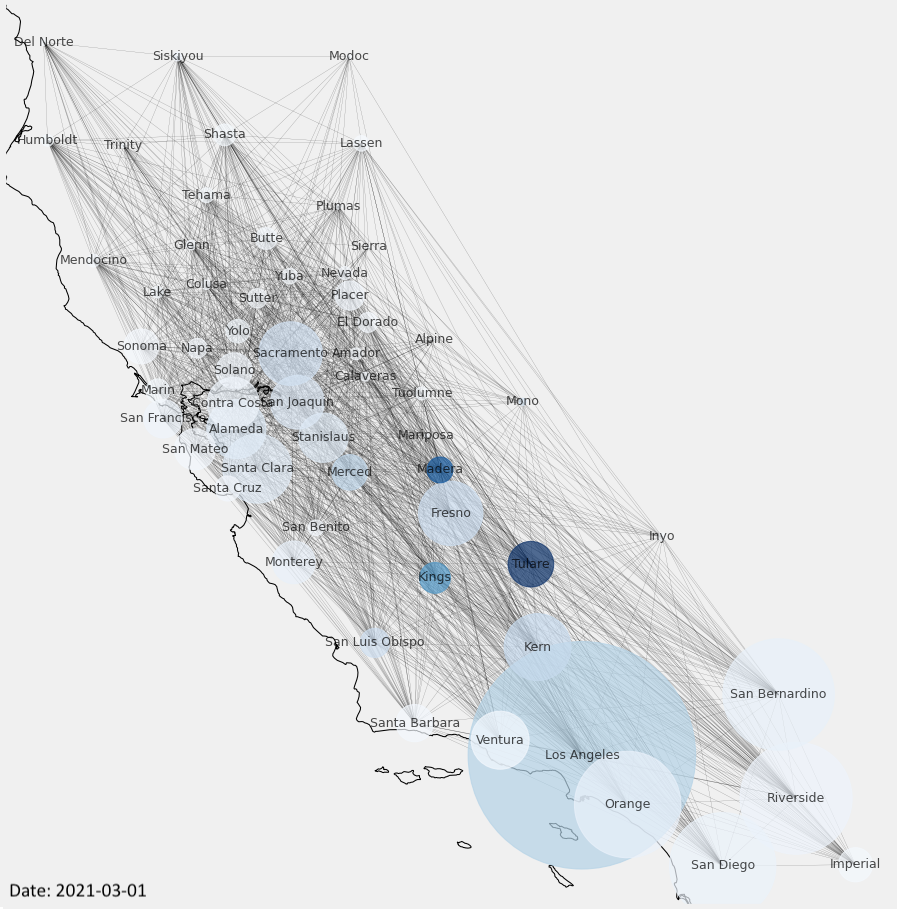

# Features and Mobility Flow Analysis During the COVID-19 Pandemic
The contagious nature of COVID-19 has allowed the virus to propagate quickly and globally. To mitigate the damage caused by the pandemic, it is vital to uncover the factors that most impact the spread of the disease so that policymakers can make informed public health decisions. In our project, we attempt to identify the features that most influences COVID-19 infection rates through statistical analysis. Additionally, we attempt to visualize the effectiveness of California's lockdown by utilizing human mobility flow data and combining it with county-level infection cases during the pandemic.  

**Sample visualization generated by our proposed method:** 

# Table of Contents  
1. [Folder Organization](#folder)
2. [Code Usage](#run)  
3. [About Dataset](#data) 

## Folder Organization
1. **model** : contains all **.ipynb** for our models and visualizations
2. **data.zip** : contains the dataset we used for this project
3. **requirement.txt** required Python libraries for this project
3. **CovidAnalysis.pdf** project report explain detailed problem definition, proposed methodology and experiments result

## How to Run Code
1. Install the correct versions of the required Python libraries (or “packages”) to run the Python code we’ve written
<pre>
pip install -r requirements.txt
</pre>

2. Download ./Model folder and data.zip file. Then unzip ./data.zip folder 

3. Reproduce all the model result or visualization by running jupyter notebooks

## About Dataset
Our final, analysis-based dataset is consolidated from three separate datasets, which we explain in detail:

1. **2020 Census:** The 2020 census data has a large variety of datasets corresponding to multiple societal topics (e.g. income, location, employment, family) -- and granular breakdowns for each category. Due to the complex computational need for full analysis, we select specific subcategories to integrate within our model. These subcategories include Income-Poverty Ratio, Age, Education Level, Population, and Population Density.

2. **COVID-19 Infection Data:** COVID-19's effect on the country has been recorded consistently by the CDC, allowing for readily available data. This dataset contains daily cumulative infections and deaths by county. 

3. **County-level Adjacency Matrix** To ensure a graphical component to our analysis, we obtained a dataset that represents, on a county level, neighboring counties to any of the ~3000 points within the US. 

4. **Multi-scale Dynamic Human Mobility Flow Dataset** This <a href=https://github.com/GeoDS/COVID19USFlows> dataset </a> attempted to predict human mobility flow during the COVID-19 epidemic. It is an up-to-date multiscale dynamic human mobility flow dataset across the United States,